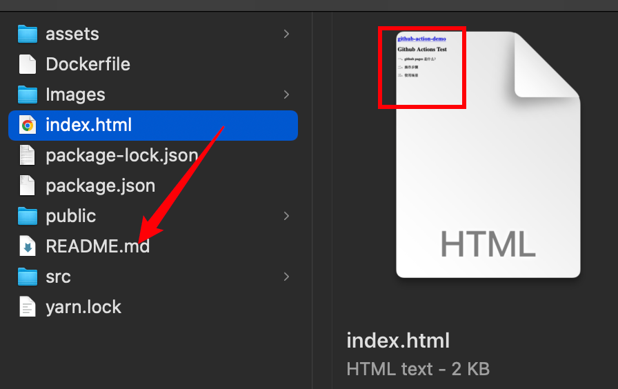
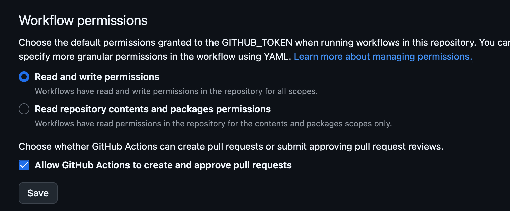
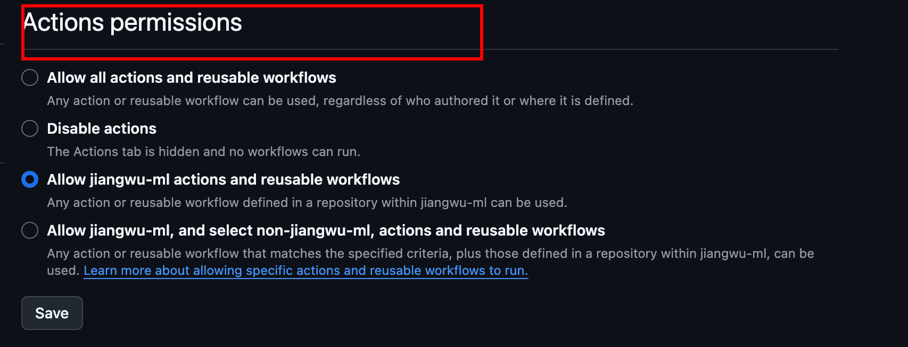
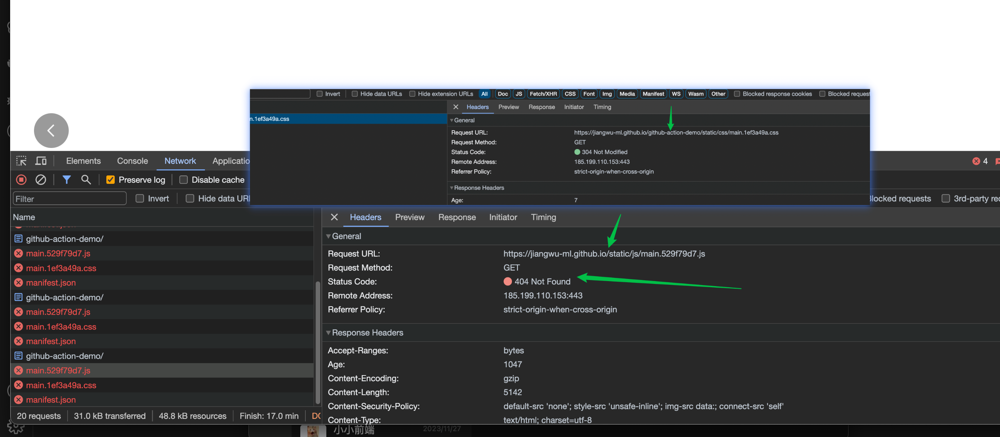

# Github Actions and Github Pages

成果展示：

[通过 gihub action 和 github pages 部署的 react 项目的网页](https://jiangwu-ml.github.io/github-action-demo/)

[通过 github pages 部署的 md 文档的静态网页](https://jiangwu-ml.github.io/market/)

[通过 gihub action 和 docker image 部署的 react 项目的网页](http://123.60.160.90:8089/)

### 一、是什么？

1、github pages

reference： [quickstart](https://docs.github.com/zh/pages/quickstart)

> 用来存储、托管静态文档的仓库。

> 可以直接通过 setting 去手动设置。此时，默认通过 README.md 作为入口

> 通过 actions 在.yml 文件中配置，可以 build、并部署 react 项目。

> 有一个 静态网站生成器[vuepress](https://vuepress.vuejs.org/zh/guide/#%E5%AE%83%E6%98%AF%E5%A6%82%E4%BD%95%E5%B7%A5%E4%BD%9C%E7%9A%84) ,可以支持配置式生成静态资源文件的页面搭建

所以就是说可以 只使用 github pages 不使用 github actions,去搭建一个静态网站。

> 但是此时只能 生成 以 md 文件为入口的 build 文件夹，只能展示 md 文件的内容。即无法通过访问 react 项目 的页面。

2、github actions

reference: [link](https://docs.github.com/zh/pages/getting-started-with-github-pages/configuring-a-publishing-source-for-your-github-pages-site#%E4%BD%BF%E7%94%A8%E8%87%AA%E5%AE%9A%E4%B9%89-github-actions-%E5%B7%A5%E4%BD%9C%E6%B5%81%E8%BF%9B%E8%A1%8C%E5%8F%91%E5%B8%83)

> 类似 cicd 自动化继承、检测、部署

> github actions 设置在.yml 文件，其可以包含 github pages 的设置。

> 可以支持部署到：github 的另一个分支、远程云服务器、gitee...

### 二、实践过程中的问题

##### 1、github 上的 pages-build-deployment workflow 是怎么生成的？

-- 是设置在 setting - pages 里的设置的吗？是的。只要在 settings 里配置了。就会默认生成一个 _pages-build-deployment_ workflow 用来生成静态页面。

##### 2、为什么 pages-build-deployment workflow build 相比自定义的 ations 的 workflow 就很简单呢？

-- 因为没有 install build 和 deploy、等复杂操作.直接就是根据入口文件、样式文件、以及 github pages 内置的风格去生成一个页面。

##### 3、github pages build 出的来的东西是什么？ 是 react 的项目的 build 文件吗?

--两种情况 。

###### 3.1 settings - Pages - Branch 配置的分支下是 react build 后的文件内容,没有 readme.md 文档，那么他就会根据 index.html 入口文件生成 react 项目的真实页面

###### 3.2 settings - Pages - Branch 配置的分支下是一些普通的文件有 readme.md 文档，那么他就会根据 readme.md 文档 入口文件生成 index.html 文件，然后展示它。如下图

##### 4、如果我想通过 actions 部署到 github-pages 的是个 react 项目。但是通过 github pages 单独配置出的是个 md 写成的静态网页。怎么做？

--不可以实现。一个 repository 只能生成一个站点。且无论是 md 还是 react 项目，都得通过 github-pages 来操作。actions 无法单独完成。

生成一个 react 项目的站点方式如下：

###### 4.1 拥有一个项目，并存到了 github 仓库。

###### 4.2 根据本项目中的 .yml 文件生成一个文件。（actions 文件中要确保有 build\deploy 的操作，并 build 的文件夹推送到指定的 分支 A）

###### 4.2 根据下文 根据第六点做前置操作

###### 4.3 手动在 settings - pages - 配置 分支 A 为 pages 识别的 分支

> ps: 其实 package.json 文件 不需要 "homepage": "https://[your github name].github.io/[your github repository]" 这行。
> 因为 在 4.3 中 pages 会为我们自动生成的！！
> 

##### 5、关于 ACCESS_TOKEN 的 生成、作用 、过期了怎么办？

生成：参考 6.1

作用：clone 代码、actions 操作...

过期：需要重新更新，每个仓库都要更新

##### 6、报错解决：github actions permission denied

原因：

> 1、没设置私钥
> 2、没把私钥放到仓库的 secrets 下
> 3、没给此 repository 设置 actions 的读写分支的权限

###### 6.1、not create personal-access-tokens

ref: [how to create personal-access-tokens](https://docs.github.com/en/authentication/keeping-your-account-and-data-secure/managing-your-personal-access-tokens#creating-a-personal-access-token-classic)

###### 6.2、not add personal-access-tokens to the repository /or/ the personal-access-tokens has expired

ref: [how to use-secrets-in-github-actions](https://docs.github.com/zh/actions/security-guides/using-secrets-in-github-actions)

###### 6.3、not open the rw permission to github-actions for the repository

指定项目 - settings - Actions - General -( Actions permissions + Workflow permissions )

ref: [how to open the rw permission to github-actions-for-a-repository](https://docs.github.com/en/repositories/managing-your-repositorys-settings-and-features/enabling-features-for-your-repository/managing-github-actions-settings-for-a-repository)

##### 7、报错解决：main.xxx.js，即 build 后的资源文件获取时 404 + deploy 后 pages-build-deployment workflow 不自动执行。

如下图：路径里缺少 '/github-action-demo/' 导致的 404 问题。

解决方法：
package.json 添加如下：
"homepage": "https://jiangwu-ml.github.io/github-action-demo/"

> 注意：加了 homepage ，github pages 上部署的不报错；云服务器部署的报错。不加 homepage , 云服务器上不报错；github pages 部署的报错。报错内容都是上图所示
